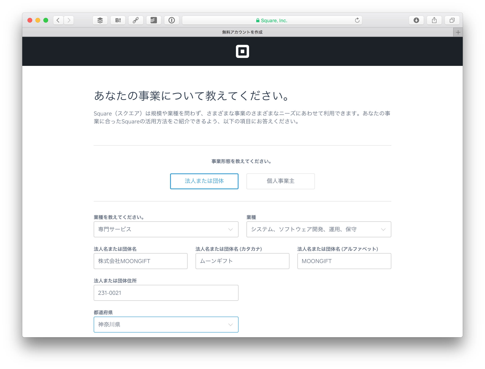
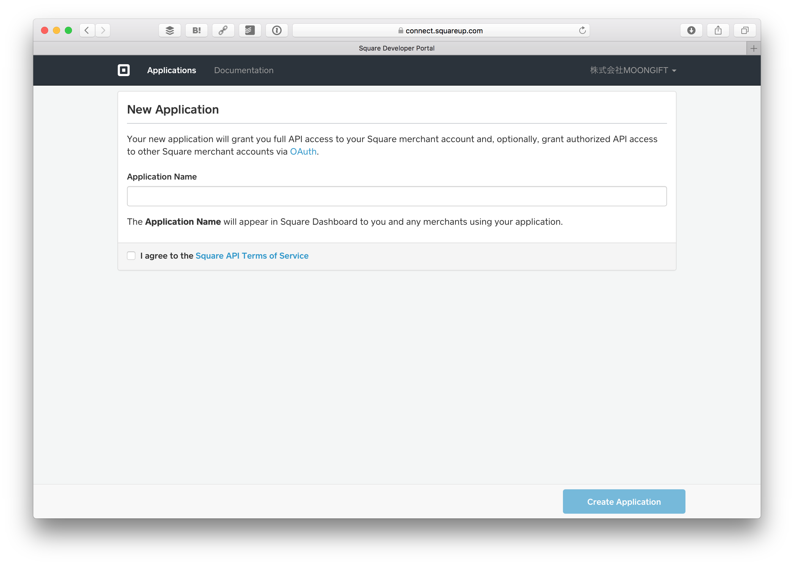

# Square APIを利用する環境設定

この章ではSquare APIを利用するまでの手順について紹介します。まず、Squareにてユーザ登録を行います。

## ユーザ登録

SquareのWebサイト（https://squareup.com/jp）へ行き、「今すぐ無料のアカウントを作成する」をクリックします。

最初にメールアドレスとパスワードを入力します。そして続行ボタンをクリックします。

次に事業形態、法人名、住所などを入力します。入力したら続行ボタンをクリックします。

次は代表者情報を入力します。

最後に入金される口座情報を入力します。

Squareリーダーの注文が出ますが、今回は「あとで注文する」をクリックしてスキップします。

これで準備が完了しました。

## 開発者ポータル設定

ユーザ登録が終わったら、開発者ポータル（https://squareup.com/jp/developers）でも設定をします。

開発者ポータルにログインします。

New Applicationをクリックします。

Application Name（アプリケーション名。任意）を入力して、Create Applicationをクリックします。ここまででアプリケーションの作成が完了します。

## キーについて

アプリケーションの登録が完了すると、認証情報が出てきます。二つの認証情報が表示され、それぞれ用途が異なりますので注意してください。

- **Application ID**  
アプリケーションを特定するための識別子です。プログラムの中ではクライアントIDとして扱われますので注意してください。
- **Personal Access Token**  
あなたのアカウントへアクセするためのアクセストークンです。取り扱いに注意してください。

また、本番環境用とサンドボックス用の2種類があります。

### 注意点

POSレジAPIはApp Store/Google Playに掲載されているアプリを利用します。そのためサンドボックスのアプリケーションIDは使えませんので注意してください。

## その他必要なサービス/ソフトウェア

今回利用するその他のサービス/ソフトウェアについてです。

- **Heroku（https://heroku.com）**  
サーバサイドで動くソフトウェアを扱う際に利用します。アカウントを取得してください。
- **Node.js（https://nodejs.org/ja/）**  
サーバサイドで動くソフトウェアを開発する際に利用します。インストールしてください。
- **Ruby（https://www.ruby-lang.org/ja/）**  
Herokuを操作する際に利用します。インストールしてください。
- **Git（https://git-scm.com）**  
Herokuにデプロイする時に使います。インストールしてください。

----

環境設定が終わったら[POSレジAPIを使ったアプリケーション開発を開始](./2.md)しましょう。