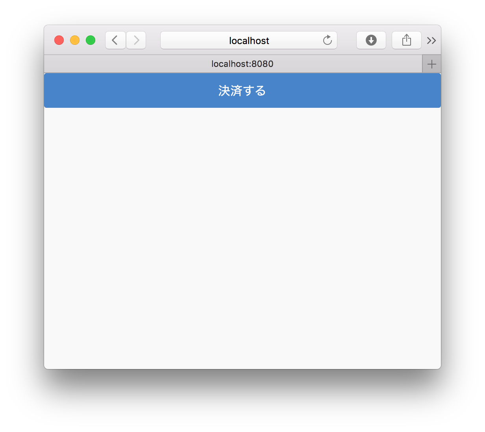

# HTMLの作成

ここでは決済を行うためのHTMLフォームを作成します。Android、iOS共通になります。

## 完成図

完成図です。




## リポジトリをダウンロード

まず[goofmint/Square_Handson](https://github.com/goofmint/Square_Handson)のリポジトリをダウンロードしてください。クローンする場合は、まずフォークしてから行ってください。

このダウンロードした中で開発を行っていきます。このリポジトリでは次のような設定が行われています。

1. Node.js用のアプリケーションサーバExpressを組み込み済み
2. Webブラウザ用のJavaScript/CSSライブラリを組み込み済み（Onsen UI/jQuery）
3. Heroku用のProcfileを配置済み
4. 最低限のExpress用ファイル（index.js）作成済み
5. 静的ファイルの公開ディレクトリを public に指定済み
6. Bowerのインストールディレクトリを public/vendords に設定済み

**ここではHeoku/Procfile/Bower/Expressといった説明は省きます**

## npm/Bowerライブラリのインストール

ダウンロードしたディレクトリに入り、コマンドを実行してください。まずnpmを使ってExpressをインストールします。

```
$ cd /path/to/directory
$ npm install
```

次にBowerを使ってOnsen UI/jQueryをインストールします。

```
$ node_modules/bower/bin/bower install
```

## Herokuの準備

Herokuのアカウントはすでに取られていることとします。まずRubygemsでHeroku用のライブラリをインストールします。

```
$ gem install heroku
```

インストールが終わったらログインします。

```
$ heroku login
```

## Gitリポジトリを初期化

**# フォークした場合は不要です**

ダウンロードした場合、Gitリポジトリがありませんので初期化を行います。

```
$ git init .
```

そしてすべて追加してください。

```
$ git add .
$ git commit -m "Init"
```

## HTMLを確認する

デフォルトのHTML（public/index.html）は次のようになっています。HTML5の基本的なテンプレートをベースに、Onsen UI/jQueryを組み込んでいます。

```
<!DOCTYPE html>
<html>
  <head>
    <meta http-equiv="X-UA-Compatible" content="IE=edge">
    <title></title>
    <meta charset="utf-8">
    <meta name="description" content="">
    <meta name="author" content="">
    <meta name="viewport" content="width=device-width, initial-scale=1">
    <!--[if lt IE 9]>
    <script src="//cdn.jsdelivr.net/html5shiv/3.7.2/html5shiv.min.js"></script>
    <script src="//cdnjs.cloudflare.com/ajax/libs/respond.js/1.4.2/respond.min.js"></script>
    <![endif]-->
    <link rel="shortcut icon" href="">
    <link rel="stylesheet" href="vendors/onsenui/css/onsenui.min.css" />
    <link rel="stylesheet" href="vendors/onsenui/css/onsen-css-components.min.css" />
  </head>
  <body>
    <!-- ons-page でページを定義 -->
      <!-- ツールバー -->
      
      <!-- リスト -->
        
        <!-- 決済額 -->
        
        <!-- 決済に関する説明 -->
        
        <!-- 決済方法（複数選択可） -->
      
      <!-- 決済開始するためのボタン -->
    
    <script src="vendors/onsenui/js/onsenui.min.js"></script>
    <script src="vendors/jquery/dist/jquery.min.js"></script>
  </body>
</html>
```

ちゃんと組み込めているか確認するため、 `<body>` の下に次のように記述してみます。

```
<body>
  <!-- 追加 -->
  <ons-page>
    <ons-button modifier="large" id="square">決済する</ons-button>
  </ons-page>
```

そしてExpressを立ち上げます。

```
$ node index.js 
```

`http://127.0.0.1:3000/ を開いてください。` と表示されますので、 `http://127.0.0.1:3000/` をWebブラウザで開きます。

以下のように表示されたら問題ありません。


## Herokuにデプロイする

続けてHerokuへのデプロイを確認します。まず上記で編集した内容をGitリポジトリに追加します。

```
$ git commit -a -m "ボタン追加"
```

Herokuにインスタンスを作成します。

```
$ heroku create
```

このコマンドが完了すると、git remoteにherokuが追加されていますので、そのままデプロイできます。

```
$ git push heroku master
```

そして最後に表示されるURLにアクセスすれば、同じ画面が表示されるはずです。

----

ここまででHTTPサーバのセットアップ、必要なライブラリのインストールが終わりました。次回はHTMLフォームを作っていきます。

ここからAndroidとiOSで若干実装が異なります（一つにまとめることもできます）。[Android](./2-2-2.md)と[iOS](./2-2-1.md)に分かれてお読みください。
