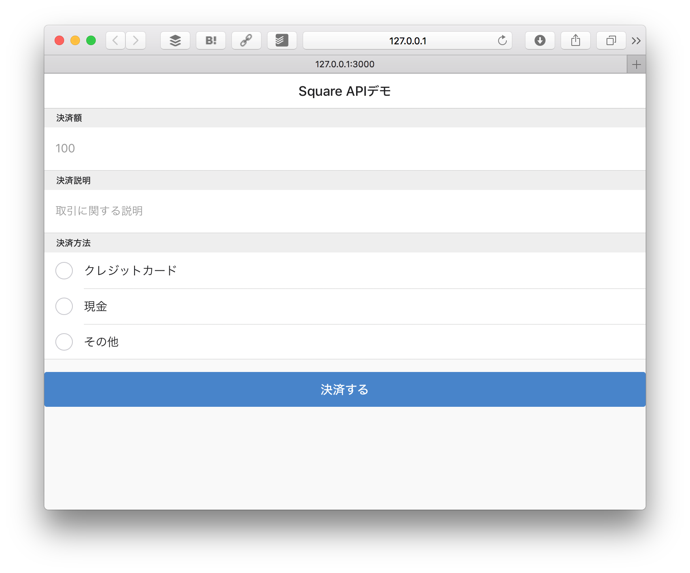

# HTMLの作成

ここでは決済を行うためのHTMLフォームを作成します。Android、iOS共通になります。

## 完成図

完成図です。



## リポジトリをダウンロード

まず[goofmint/Square_Handson](https://github.com/goofmint/Square_Handson)のリポジトリをダウンロードしてください。クローンする場合は、まずフォークしてから行ってください。

このダウンロードした中で開発を行っていきます。このリポジトリでは次のような設定が行われています。

1. Node.js用のアプリケーションサーバExpressを組み込み済み
2. Webブラウザ用のJavaScript/CSSライブラリを組み込み済み（Onsen UI/jQuery）
4. 最低限のExpress用ファイル（index.js）作成済み
5. 静的ファイルの公開ディレクトリを public に指定済み
6. Bowerのインストールディレクトリを public/vendords に設定済み

**ここではBower/Expressといった説明は省きます**

## npm/Bowerライブラリのインストール

ダウンロードしたディレクトリに入り、コマンドを実行してください。まずnpmを使ってExpressをインストールします。

```
$ cd /path/to/directory
$ npm install
```

次にBowerを使ってOnsen UI/jQueryをインストールします。

```
$ node_modules/bower/bin/bower install
```

## HTMLを確認する

デフォルトのHTML（public/index.html）は次のようになっています。HTML5の基本的なテンプレートをベースに、Onsen UI/jQueryを組み込んでいます。

```
<!DOCTYPE html>
<html>
  <head>
    <meta http-equiv="X-UA-Compatible" content="IE=edge">
    <title></title>
    <meta charset="utf-8">
    <meta name="description" content="">
    <meta name="author" content="">
    <meta name="viewport" content="width=device-width, initial-scale=1">
    <!--[if lt IE 9]>
    <script src="//cdn.jsdelivr.net/html5shiv/3.7.2/html5shiv.min.js"></script>
    <script src="//cdnjs.cloudflare.com/ajax/libs/respond.js/1.4.2/respond.min.js"></script>
    <![endif]-->
    <link rel="shortcut icon" href="">
    <link rel="stylesheet" href="vendors/onsenui/css/onsenui.min.css" />
    <link rel="stylesheet" href="vendors/onsenui/css/onsen-css-components.min.css" />
  </head>
  <body>
    : 省略
  </body>
</html>
```

そしてExpressを立ち上げます。

```
$ node index.js 
```

`http://127.0.0.1:3000/ を開いてください。` と表示されますので、 `http://127.0.0.1:3000/` をWebブラウザで開きます。

unirestがないというエラーが出るかも知れません。その場合はターミナルで `npm install unirest --save` と実行してください。

以下のように表示されたら問題ありません。


----

ここまででHTTPサーバのセットアップ、必要なライブラリのインストールが終わりました。次回は決済処理を作っていきます。

[レジアプリの呼び出し](./2-2.md)に進んでください。
