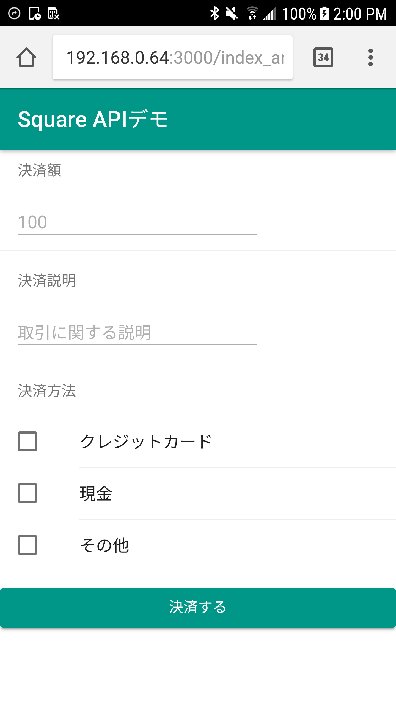

# HTMLフォームを作る（Android）

では決済処理を行う際に必要な情報を入力するHTMLフォームを作っていきます。これもまたOnsen UIの機能を使っていきます。

## 全体像

bodyタグの内容は次のようになっています（前回追加したボタンは消しています）。まず全体像です。

```
<!-- ons-page でページを定義 -->

  <!-- ツールバー -->
  
  <!-- リスト -->
    <!-- 決済額 -->
    
    <!-- 決済に関する説明 -->
    
    <!-- 決済方法（複数選択可） -->
    
  <!-- 決済開始するためのボタン -->
```

## ons-page でページを定義

`ons-` ではじまるタグはOnsen UI特有のものと考えてください。HTML全体をページと言う単位で管理しますので、今回の場合は全体を `<ons-page />` で囲みます。

```
<!-- ons-page でページを定義 -->
<ons-page>
  <!-- ツールバー -->
    :（省略）
  <!-- 決済開始するためのボタン -->
</ons-page>
```

## ツールバー

ツールバーは `<ons-toolbar />` で表現できます。

```
<!-- ツールバー -->
<ons-toolbar>
  <div class="center">Square APIデモ</div>
</ons-toolbar>
```

## リスト

今回はフォームの各項目を一覧で表示します。その際に使えるのが `<ons-list />` になります。

```
<!-- リスト -->
<ons-list>
  <!-- 決済額 -->
    :（省略）
  <!-- 決済方法（複数選択可） -->
</ons-list>
```

### 決済額

決済額は自由入力です。数字を入力します。 `<ons-list-header />` と `<ons-list-item />` のセットで記述します。

```
<!-- 決済額 -->
<ons-list-header>決済額</ons-list-header>
<ons-list-item>
  <ons-input id="price" placeholder="100" float></ons-input>
</ons-list-item>
```

### 決済に関する説明

決済に関する説明も決済額と同じく自由入力です。こちらも `<ons-list-header />` と `<ons-list-item />` のセットで記述します。

```
<!-- 決済に関する説明 -->
<ons-list-header>決済説明</ons-list-header>
<ons-list-item>
  <ons-input id="notes" placeholder="取引に関する説明" float></ons-input>
</ons-list-item>
```

### 決済方法（複数選択可）

決済方法は複数指定可能なので、チェックボックスを使って指定できるようにします。今回はクレジットカード、現金、その他を指定できるようにします。

```
<!-- 決済方法（複数選択可） -->
<ons-list-header>決済方法</ons-list-header>
<ons-list-item tappable>
  <label class="left">
    <ons-checkbox input-id="credit-card" value="com.squareup.pos.TENDER_CARD" name="supported_tender_types[]"></ons-checkbox>
  </label>
  <label for="credit-card" class="center">
    クレジットカード
  </label>
</ons-list-item>
<ons-list-item tappable>
  <label class="left">
    <ons-checkbox input-id="cash" value="com.squareup.pos.TENDER_CASH" name="supported_tender_types[]"></ons-checkbox>
  </label>
  <label for="cash" class="center">
    現金
  </label>
</ons-list-item>
<ons-list-item tappable>
  <label class="left">
    <ons-checkbox input-id="other" value="com.squareup.pos.TENDER_OTHER" name="supported_tender_types[]"></ons-checkbox>
  </label>
  <label for="other" class="center">
    その他
  </label>
</ons-list-item>
```

### 決済開始するためのボタン

最後に決済開始するためのボタンを配置します。これは `<ons-button />` を使います。

```
<!-- 決済開始するためのボタン -->
<p>
  <ons-button modifier="large" id="square">決済する</ons-button>
</p>
```

## 完成形

完成形のHTMLは次のようになります。これは bodyタグ内の内容です。

```
<!-- ons-page でページを定義 -->
<ons-page>
  <!-- ツールバー -->
  <ons-toolbar>
    <div class="center">Square APIデモ</div>
  </ons-toolbar>
  
  <!-- リスト -->
  <ons-list>
    
    <!-- 決済額 -->
    <ons-list-header>決済額</ons-list-header>
    <ons-list-item>
      <ons-input id="price" placeholder="100" float></ons-input>
    </ons-list-item>
    
    <!-- 決済に関する説明 -->
    <ons-list-header>決済説明</ons-list-header>
    <ons-list-item>
      <ons-input id="notes" placeholder="取引に関する説明" float></ons-input>
    </ons-list-item>
    
    <!-- 決済方法（複数選択可） -->
    <ons-list-header>決済方法</ons-list-header>
    <ons-list-item tappable>
      <label class="left">
        <ons-checkbox input-id="credit-card" value="com.squareup.pos.TENDER_CARD" name="supported_tender_types[]"></ons-checkbox>
      </label>
      <label for="credit-card" class="center">
        クレジットカード
      </label>
    </ons-list-item>
    <ons-list-item tappable>
      <label class="left">
        <ons-checkbox input-id="cash" value="com.squareup.pos.TENDER_CASH" name="supported_tender_types[]"></ons-checkbox>
      </label>
      <label for="cash" class="center">
        現金
      </label>
    </ons-list-item>
    <ons-list-item tappable>
      <label class="left">
        <ons-checkbox input-id="other" value="com.squareup.pos.TENDER_OTHER" name="supported_tender_types[]"></ons-checkbox>
      </label>
      <label for="other" class="center">
        その他
      </label>
    </ons-list-item>
  </ons-list>
  
  <!-- 決済開始するためのボタン -->
  <p>
    <ons-button modifier="large" id="square">決済する</ons-button>
  </p>
</ons-page>

<script src="vendors/onsenui/js/onsenui.min.js"></script>
<script src="vendors/jquery/dist/jquery.min.js"></script>
```

これをWebブラウザで表示すると次のようになります。



----

では次回から実際に決済処理を実行するところを作っていきます。[レジアプリの呼び出し（Android）](./2-3-2.md)に進んでください。

