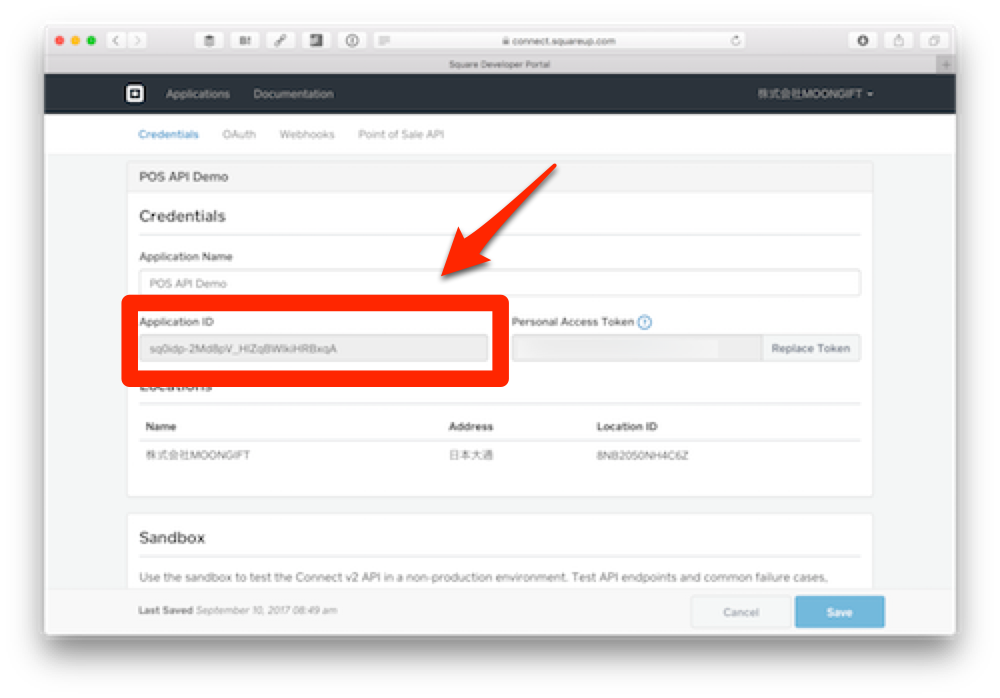

# レジアプリの呼び出し

ではレジアプリを呼び出す部分を作ります。これはJavaScriptで実装しますので、 `public/js/app.js` の中に作っていきます。

```
  <script src="vendors/onsenui/js/onsenui.min.js"></script>
  <script src="vendors/jquery/dist/jquery.min.js"></script>
  <script src="js/app.js"></script>
</body>
```

では作っていきます。

## 全体像

最初は以下のように書かれているはずです。この内容は `public/js/app.js` になります。

```
// 定数の定義
var url = ''; // コールバックされるURL
var client_id = ''; // SquareのアプリケーションID
// ブラウザ判定
var ios =/iPad|iPhone|iPod/.test(navigator.userAgent);
// 決済方法の指定（AndroidとiOSで異なります）
var supported_tender_types = {};
if (ios) {
  supported_tender_types = {
    credit_card: "CREDIT_CARD",
    cash: "CASH",
    other: "OTHER"
  }
}else{
  supported_tender_types = {
    credit_card: "com.squareup.pos.TENDER_CARD",
    cash: "com.squareup.pos.TENDER_CASH",
    other: "com.squareup.pos.TENDER_OTHER"
  }
}

// Onsen UIが使える状態になったところから処理開始
ons.ready(function() {
  // ボタンを押した時のイベント処理
  $('#square').on('click', function(e) {
    // 変数の取得
    
    // パラメータの生成
    
    // URLの生成
    
    // POSレジアプリ呼び出し
  });
});
```

## 定数の定義

今回利用する定数は次の通りです。

```
// 定数の定義
var url = ''; // コールバックされるURL
var client_id = ''; // SquareのアプリケーションID
```

### コールバックURLについて

まずコールバックされるURLはngrokで指定されたURLになります。

```
$ ngrok http 3000
```

例えば `http://611f340a.ngrok.io` です。client_idはSquare Developer Portalで確認できるApplication IDになります。なお、このURLはngrokを実行する度に変わります。そして、node.jsのサーバを立ち上げ直すとngrokとの接続が切れてしまいます。必要に応じてURLを設定し直してください。



**POSレジアプリは本番環境のアプリケーションIDでしか動きませんので注意してください。サンドボックスのものは使えません。**

さらにこのコールバックURLはSquare Developer Portalの **Point of Sale API > Web > Web Callback URLs** にも指定します。


## ブラウザ判定

今回はiOSかどうかで判定を作っています。

```
var ios =/iPad|iPhone|iPod/.test(navigator.userAgent);
```

## 決済方法の指定

iOSのカスタムURLスキーマ、Androidのインテントで決済方法の呼び出し方が違います。それを吸収する処理になります。

```
// 決済方法の指定（AndroidとiOSで異なります）
var wrap_supported_tender_types = {};
if (ios) {
  wrap_supported_tender_types = {
    credit_card: "CREDIT_CARD",
    cash: "CASH",
    other: "OTHER"
  }
}else{
  wrap_supported_tender_types = {
    credit_card: "com.squareup.pos.TENDER_CARD",
    cash: "com.squareup.pos.TENDER_CASH",
    other: "com.squareup.pos.TENDER_OTHER"
  }
}
```

## ボタンを押した時のイベント処理

ボタンを押した時の処理はjQueryで行います。

```
// ボタンを押した時のイベント処理
$('#square').on('click', function(e) {
  // 変数の取得
  
  // パラメータの生成
  
  // URLの生成
  
  // POSレジアプリ呼び出し
});
```

## 変数の取得

今回の変数は次の通りです。

- 決済額
- 決済内容
- 提供する決済方法

### 決済額

決済額は次のように得られます。

```
var price = $('#price').val();
```

### 決済内容

決済内容は次のように得られます。

```
var notes = $('#notes').val();
```

### 提供する決済方法

決済方法はチェックされているものだけを取得するので若干複雑になります。iOSとAndroidの差異を吸収できるようにしています。

```
var supported_tender_types = $("input[name='supported_tender_types[]']:checked").map(function() {
  return wrap_supported_tender_types[$(this).val()];
}).toArray();
```

## パラメータの説明

変数を取得した結果、POSレジアプリに送るパラメータは次のようになります。ここはiOSとAndroidで異なるので注意してください。

### iOSの場合

```
var dataParameter = {
  // 金額に関する情報
  "amount_money": {
    "amount": price,
    "currency_code" : "JPY"
  },
  // POSレジアプリがコールバックするURL
  "callback_url" : url,
  // アプリケーションID（自分のものに置き換えてください）
  "client_id" : client_id,
  // バージョン（現在は1.3固定です）
  "version": "1.3",
  // 取引に関する説明書き
  "notes": notes,
  "options": {
    "supported_tender_types": supported_tender_types
  }
};
```

### Androidの場合

```
var dataParameter = {
  // インテントのアクション。 com.squareup.pos.action.CHARGE 固定です。
  "action": "com.squareup.pos.action.CHARGE",
  // POSレジアプリがコールバックするURL
  "S.com.squareup.pos.WEB_CALLBACK_URI": url,
  // アプリケーションID（自分のものに置き換えてください）
  "S.com.squareup.pos.CLIENT_ID": client_id,
  // バージョン（現在は1.3固定です）
  "S.com.squareup.pos.API_VERSION": 'v1.3',
  // 金額に関する情報
  "i.com.squareup.pos.TOTAL_AMOUNT": price,
  "S.com.squareup.pos.CURRENCY_CODE": "JPY",
  // 利用できる決済方法
  "S.com.squareup.pos.TENDER_TYPES": supported_tender_types.join(","),
  // パッケージ。必ず com.squareup を指定
  "package": "com.squareup",
  // 取引に関する説明書き
  "S.com.squareup.pos.NOTE": notes
};
```

## レジアプリの呼び出し方

レジアプリの呼び出し方もiOSとAndroidで異なりますので注意してください。

### カスタムURLスキーマの生成（iOSの場合）

生成したパラメータを元にURLを作ります。呼び出すURLスキーマは `square-commerce-v1://payment/create` 固定で、dataパラメータに各種パラメータを渡します。

```
var uri = "square-commerce-v1://payment/create?data=" + encodeURIComponent(JSON.stringify(dataParameter));
```

### インテントの生成（Androidの場合）

生成したパラメータを元にURLを作ります。各パラメータを;繋ぎで渡すのが特徴です。また、最後に ;end と付けるのを忘れないでください。

```
// URLの生成
params = [];
for (var key in dataParameter) {
  params.push(`${key}=${dataParameter[key]}`);
}
var uri = "intent:#Intent;" + params.join(';') + ';end';
```

## POSレジアプリ呼び出し（iOS/Android共通）

そしてURLに適用すればPOSレジアプリが呼び出されます。

```
location.href = uri;
```

## JavaScript全体のコード

その結果、全体のコードは次のようになります。

```
// 定数の定義
var url = ''; // コールバックされるURL
var client_id = ''; // SquareのアプリケーションID
// ブラウザ判定
var ios =/iPad|iPhone|iPod/.test(navigator.userAgent);
// 決済方法の指定（AndroidとiOSで異なります）
var wrap_supported_tender_types = {};
if (ios) {
  wrap_supported_tender_types = {
    credit_card: "CREDIT_CARD",
    cash: "CASH",
    other: "OTHER"
  }
}else{
  wrap_supported_tender_types = {
    credit_card: "com.squareup.pos.TENDER_CARD",
    cash: "com.squareup.pos.TENDER_CASH",
    other: "com.squareup.pos.TENDER_OTHER"
  }
}

// Onsen UIが使える状態になったところから処理開始
ons.ready(function() {
  // ボタンを押した時のイベント処理
  $('#square').on('click', function(e) {
    // 変数の取得
    var price = $('#price').val();
    var notes = $('#notes').val();
    var supported_tender_types = $("input[name='supported_tender_types[]']:checked").map(function() {
      return wrap_supported_tender_types[$(this).val()];
    }).toArray();

    // パラメータの生成
    // ここはiOS/Androidで大きく異なるので省略します
    
    // URLの生成
    // ここもiOS/Androidで大きく異なるので省略します
    
    // POSレジアプリ呼び出し
    location.href = uri;
  });
});
```

## 試す

ではこのコードを試してみます。ngrokを実行します。

```
$ ngrok http 3000
```

そして、そのデプロイ先のURLにiPhoneやAndroidからアクセスします。

金額、内容、提供する決済方法を選択します。テストの際には必ず現金を有効にしておくのをお勧めします。この時、あらかじめSquareリーダーを差し込んでおくことでICチップなどを使った決済ができます。決済が無事終了するとコールバックされて最初の画面が表示されます。

----

次回はPOS APIの最後の回になります。コールバックされた内容を読み取り、画面に表示します。

[レジアプリからのコールバック処理](./2-3.md)に進んでください。
