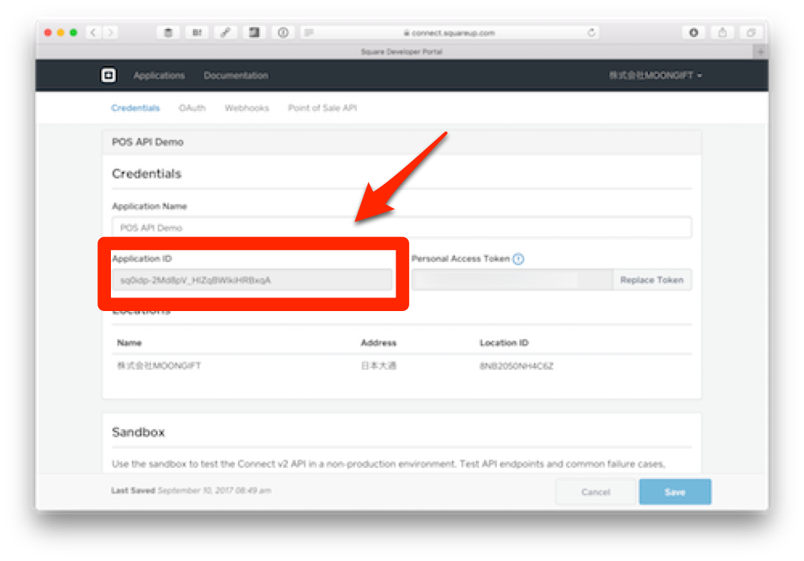
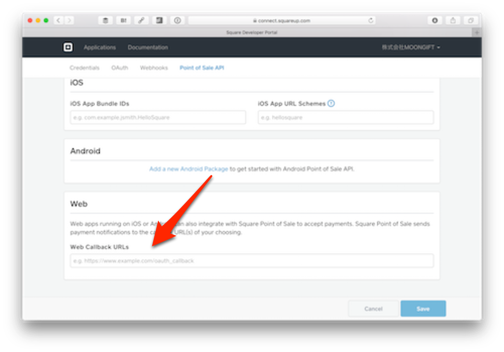

# レジアプリの呼び出し（iOS）

ではレジアプリを呼び出す部分を作ります。これはJavaScriptで実装しますので、`</body>` の上でファイルを読み込むようにします。

```
  <script src="vendors/onsenui/js/onsenui.min.js"></script>
  <script src="vendors/jquery/dist/jquery.min.js"></script>
  <!-- 追加 -->
  <script src="js/app.js"></script>
</body>
```

では作っていきます。

## 全体像

まずはコメントで全体像を紹介します。この内容は `public/js/app.js` になります。

```
// 定数の定義

// Onsen UIが使える状態になったところから処理開始
ons.ready(function() {
  // ボタンを押した時のイベント処理
    // 変数の取得
    
    // パラメータの生成
    
    // URLの生成
    
    // POSレジアプリ呼び出し
});
```

## 定数の定義

今回利用する定数は次の通りです。

```
var url = ''; // コールバックされるURL
var client_id = ''; // SquareのアプリケーションID
```

まずコールバックされるURLはngrokで指定されたURLになります。

例えば `https://aaa.ngrok.com/` です。client_idはSquare Developer Portalで確認できるApplication IDになります。



**POSレジアプリは本番環境のアプリケーションIDでしか動きませんので注意してください。サンドボックスのものは使えません。**

さらにこのコールバックURLはSquare Developer Portalの **Point of Sale API > Web > Web Callback URLs** にも指定します。



## ボタンを押した時のイベント処理

ボタンを押した時の処理はjQueryで行います。

```
// ボタンを押した時のイベント処理
$('#square').on('click', function(e) {
  // 変数の取得
  
  // パラメータの生成
  
  // URLの生成
  
  // POSレジアプリ呼び出し
});
```

## 変数の取得

今回の変数は次の通りです。

- 決済額
- 決済内容
- 提供する決済方法

### 決済額

決済額は次のように得られます。

```
var price = $('#price').val();
```

### 決済内容

決済内容は次のように得られます。

```
var notes = $('#notes').val();
```

### 提供する決済方法

決済方法はチェックされているものだけを取得するので若干複雑になります。

```
var supported_tender_types = $("input[name='supported_tender_types[]']:checked").map(function() {
  return $(this).val();
}).toArray();
```

## パラメータの説明

変数を取得した結果、POSレジアプリに送るパラメータは次のようになります。

```
var dataParameter = {
  // 金額に関する情報
  "amount_money": {
    "amount": price,
    "currency_code" : "JPY"
  },
  // POSレジアプリがコールバックするURL
  "callback_url" : url,
  // アプリケーションID（自分のものに置き換えてください）
  "client_id" : client_id,
  // バージョン（現在は1.3固定です）
  "version": "1.3",
  // 取引に関する説明書き
  "notes": notes,
  "options": {
    "supported_tender_types": supported_tender_types
  }
};
```

## URLの生成

生成したパラメータを元にURLを作ります。呼び出すURLスキーマは `square-commerce-v1://payment/create` 固定で、dataパラメータに各種パラメータを渡します。

```
var uri = "square-commerce-v1://payment/create?data=" + encodeURIComponent(JSON.stringify(dataParameter));
```

## POSレジアプリ呼び出し

そしてURLに適用すればPOSレジアプリが呼び出されます。

```
location.href = uri;
```

## JavaScript全体のコード

その結果、全体のコードは次のようになります。

```
// 定数の定義
var url = ''; // コールバックするURL
var client_id = ''; // SquareのアプリケーションID

// Onsen UIが使える状態になったところから処理開始
ons.ready(function() {
  // ボタンを押した時のイベント処理
  $('#square').on('click', function(e) {
    // 変数の取得
    var price = $('#price').val();
    var notes = $('#notes').val();
    var supported_tender_types = $("input[name='supported_tender_types[]']:checked").map(function() {
      return $(this).val();
    }).toArray();

    // パラメータの生成
    var dataParameter = {
      // 金額に関する情報
      "amount_money": {
        "amount": price,
        "currency_code" : "JPY"
      },
      // POSレジアプリがコールバックするURL
      "callback_url" : url,
      // アプリケーションID（自分のものに置き換えてください）
      "client_id" : client_id,
      // バージョン（現在は1.3固定です）
      "version": "1.3",
      // 取引に関する説明書き
      "notes": notes,
      "options": {
        "supported_tender_types": supported_tender_types
      }
    };
    
    // URLの生成
    var uri = "square-commerce-v1://payment/create?data=" + encodeURIComponent(JSON.stringify(dataParameter));
    
    // POSレジアプリ呼び出し
    location.href = uri;
  });
});
```

## 試す

ではこのコードを試してみます。ngrokを実行します。

```
$ ngrok 3000
```

そして、そのデプロイ先のURLにiPhoneやiPadからアクセスします。

金額、内容、提供する決済方法を選択します。テストの際には必ず現金を有効にしておくのをお勧めします。この時、あらかじめSquareリーダーを差し込んでおくことでICチップなどを使った決済ができます。決済が無事終了するとコールバックされて最初の画面が表示されます。

----

次回はPOS APIの最後の回になります。コールバックされた内容を読み取り、画面に表示します。

[レジアプリからのコールバック処理（iOS）](./2-4-1.md)に進んでください。
