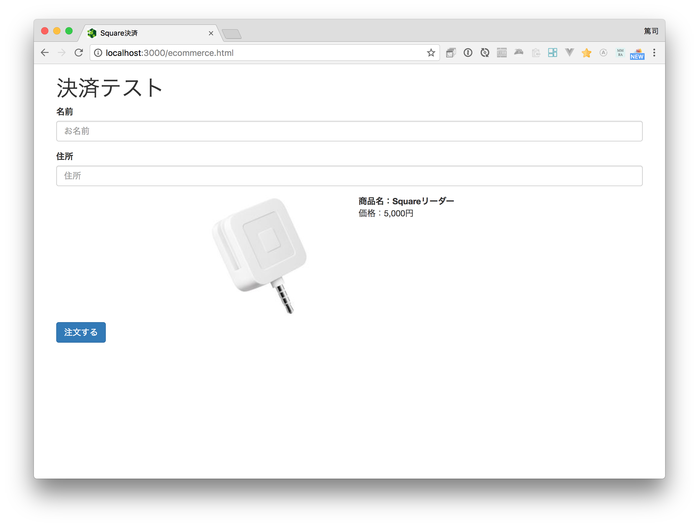

# ベースになるHTML/サーバサイドについて

このページではコーディングはしません。すでに作成済みのベースになるコードの説明をするだけです。

表示する場合には http://localhost:3000/ecommerce.html にアクセスしてください。



## ベースになるHTMLについて

パスは `public/ecommerce.html` になります。このファイルはHTML5の基本的構造に加えて下記の変更を加えてあります。

- Bootstrapの組み込み
- 基本的なフォームの作成
- js/ecommerce.js の読み込み（これから作成）

今回、入力項目は名前と住所のみとなっています。**データベースは用意していませんのでデータの保存は行いません。**

## サーバサイドについて

今回、サーバサイドはNode.js/Expressとなっています。注文処理を行う `POST /orders` だけ用意しています。 index.js の内容です。この処理はこれから作成していきます。

```
// 注文処理
app.post('/orders', function (req, res) {
  // 注文処理を実行します
  // （省略）
});
```

もちろんPHPやRubyといった他の言語で作ることもできます。

----

では最初に[HTML画面の作成](3-2.md)から行っていきます。
