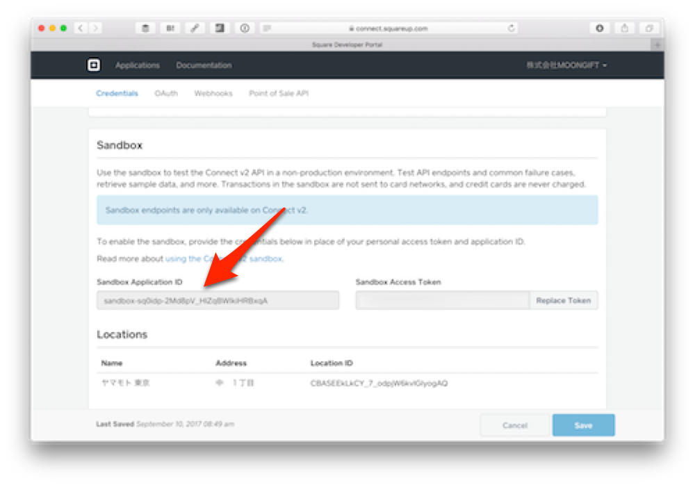
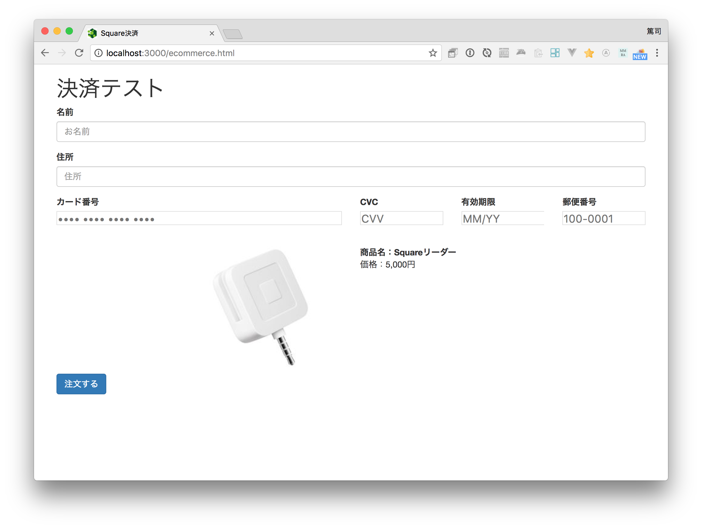
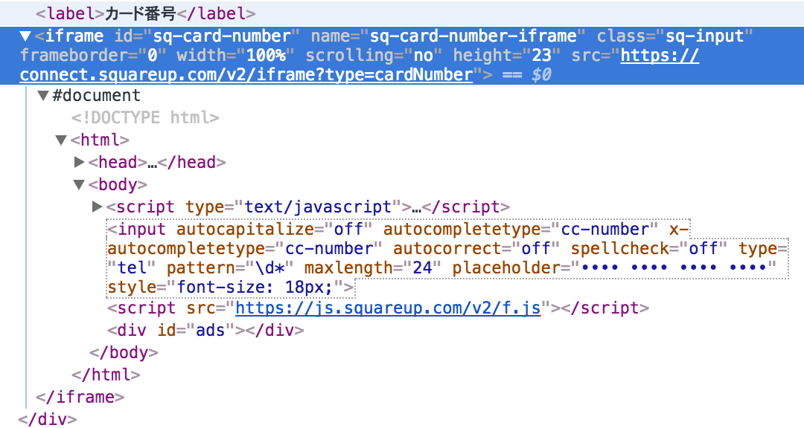

# JavaScriptでの処理

JavaScript側の処理として、まず先ほどdivタグなどで追加したクレジットカード情報入力フォームを生成します。 `js/ecommerce.js` を作成します。細かな点はコメントを参照してください。

```
// アプリケーションID
var applicationId = '';

// Square EコマースAPI用のフォームライブラリ
var paymentForm = new SqPaymentForm({
  // アプリケーションID
  applicationId: applicationId,
  // 入力用クラス（オプション）
  inputClass: 'sq-input',
  
  // ここから入力項目毎の設定です
  // カード番号
  cardNumber: {
    elementId: 'sq-card-number',
    placeholder: '•••• •••• •••• ••••'
  },
  // セキュリティコード
  cvv: {
    elementId: 'sq-cvv',
    placeholder: 'CVV'
  },
  // 有効期限
  expirationDate: {
    elementId: 'sq-expiration-date',
    placeholder: 'MM/YY'
  },
  // 郵便番号
  postalCode: {
    elementId: 'sq-postal-code',
    placeholder: '100-0001'
  },
  // 各種コールバック
  callbacks: {
    // nonceを取得した時のコールバック
    cardNonceResponseReceived: function(errors, nonce, cardData) {
    },
    
    // フォームを読み込んだ時のコールバック
    paymentFormLoaded: function() {
    },
    
    // 非対応ブラウザからのアクセスがあった時のコールバック
    unsupportedBrowserDetected: function() {
    }
  }
});
```

注意点として、jQueryなどのDOMContentLoadedイベント後にSqPaymentFormを読み込むとうまく変換されません。今回のようにDOM構築前に実行してください。

## アプリケーションIDの取得

今回はレジアプリを使いませんので、サンドボックスのアプリケーションIDを利用します。



そして取得したアプリケーションIDを設定します。

```
var applicationId = 'sandbox-sq0...xqA'; // 自分のものを設定してください。
```

## ページの読み込み

画面を読み込むと入力フォームが生成されているのが分かるはずです。



Developer Toolsなどで見ると、入力項目はiframe内に生成されているのが分かります。



----

ここまでで入力画面ができました。このようにSquareのEコマースAPIは既存のEコマースサイトの中に親和性高く追加できるのが特徴になります。デザインのカスタマイズ性も高くなっています。

次回は[EコマースAPIを使ってnonceを取得する](3-4.md)部分を作成します。
