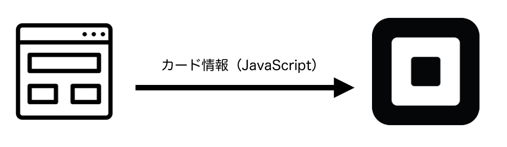
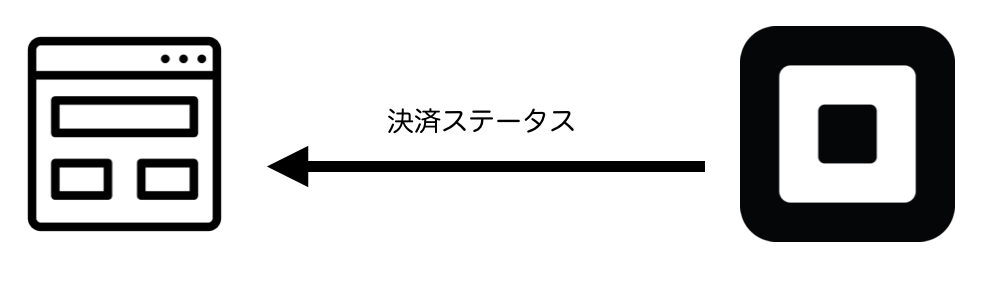

# EコマースAPIについて

ここからはSquareの提供する決済APIの一つであるEコマースAPIを実装します。まずは処理の流れを含め、仕組みを紹介します。

## 仕組み

Eコマースにおける最大のセキュリティリスクはクレジットカード情報の漏洩ではないでしょうか。SquareのEコマースAPIはクレジットカード情報をnonceと呼ばれる一回しか使えないトークンに変換することでEコマース提供事業者はカード番号を知らなくともカード決済ができるようになります。

つまり仕組みとしては一度クレジットカード情報をSquareのサーバに送ります。これはAjaxを使い、JavaScriptで送信します。

結果として返ってくるのはnonceと呼ばれるテンポラリトークンです。

そしてテンポラリトークンと実際の決済情報をSquareに送ります。この情報はサーバから送ります。今回はNode.jsを使います。

Squareから決済完了したかどうかの情報が返ってきます。

このような手順を踏むことで安全、かつ簡単にクレジットカード決済機能を提供できるようになります。

## 実装するアプリについて

今回はEコマースの決済手前までいった画面を想定します。ユーザは自分の情報を確認し、注文するボタンをクリックします。

（作成中）

そうするとクレジットカード情報をSquareに送信します。これはAjaxで送ります。上記の通り、返ってくるのはnonce情報の他、カードの下4桁などの情報です。それらをサーバに送り、実際の決済処理を実行します。

決済が通ったら完了ページを表示します。ユーザの視点としては他のECサイト同様、決済が行われたとしか感じられないでしょう。

（作成中）

----

ではまず[ベースになるHTML/サーバサイドの説明](./3-1.md)をします。
