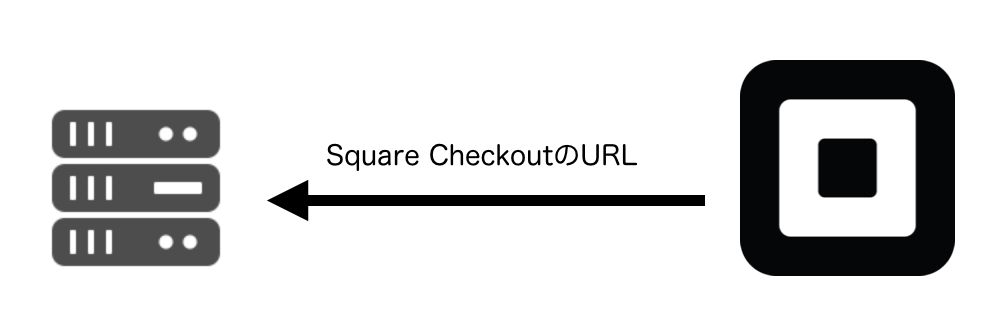
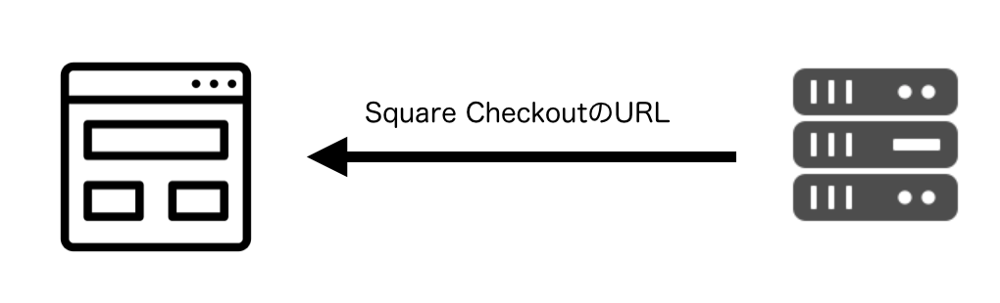
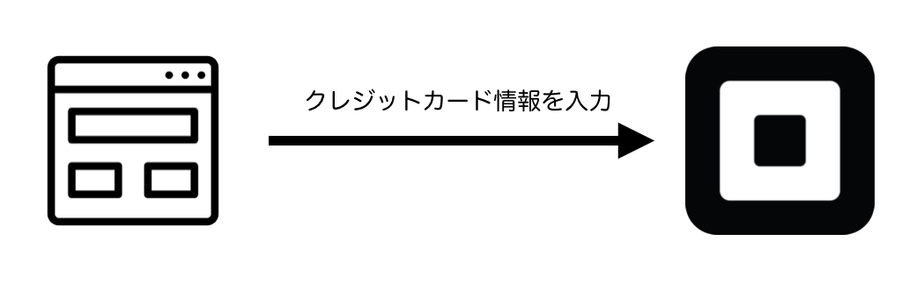
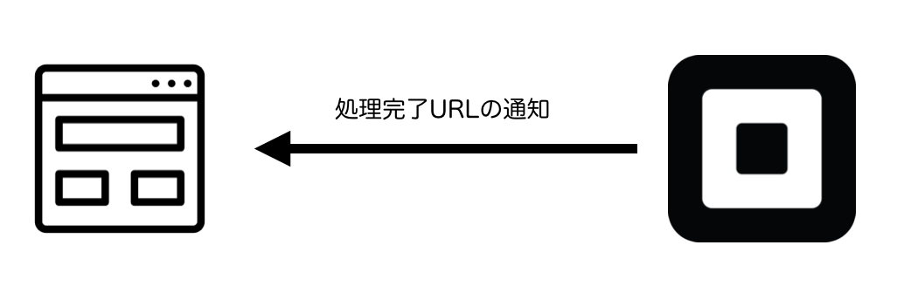

# Square Checkoutについて

Square CheckoutはSquare側に用意された画面を使って決済処理を行う仕組みです。EコマースAPIのようにデザインの自由度は高くありませんが、安全な決済を手軽に導入できます。

## 仕組みについて

Square Checkoutは一旦サーバ側からSquareのAPIをコールしてCheckout用のURLを受け取る必要があります。

まずサーバからSquareに注文情報を送信します。

そして結果としてリダイレクト先のURLを受け取ります。

サーバはそれをWebブラウザに送り、Square CheckoutのURLにリダイレクトさせます。

そして決裁者はSquare Checkoutの画面で決済情報を入力します。

決済が完了したら、Square Checkoutはあらかじめ指定されたコールバックURLへWebブラウザをリダイレクトさせます。

WebブラウザはコールバックURLにアクセスし、サーバは決済完了ページを表示します。

----

Square Checkoutの仕組みは以上です。次から実際に作っていきたいと思います。[Square Checkoutの画面を作成する](./4-1.md)に進んでください。
