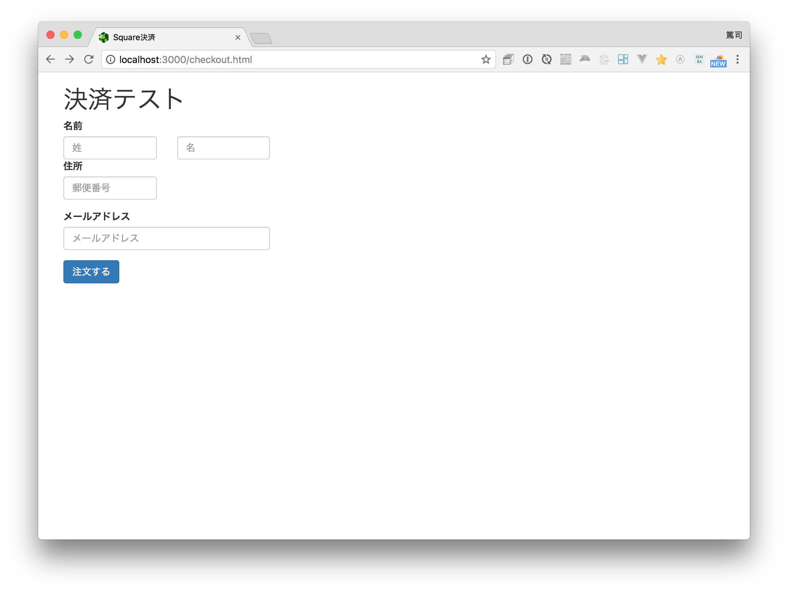

# Square Checkoutの画面について

ここからSquare CheckoutのHTML画面を紹介します。ファイルは `public/checkout.html` になります。

**このページではコーディングはしません。内容の紹介になります。**



画面を表示する場合には `http://localhost:3000/checkout.html` にアクセスしてください。

## HTMLの内容について

bodyタグ内の内容は次のようになります。ライブラリとしてBootstrapを使っています。

```
<div class="container">
  <div class="row">
    <div class="col align-self-center">
      <h1>決済テスト</h1>
      <form action="/checkout" method="post" id="commerceForm">
        <div class="form-group">
          <label for="inputName">名前</label>
          <div class="row">
            <div class="col-md-2">
              <input type="text" class="form-control" name="lastName" placeholder="姓">
            </div>
            <div class="col-md-2">
              <input type="text" class="form-control" name="firstName" placeholder="名">
            </div>
        </div>
        <div class="form-group">
          <label for="inputName">住所</label>
          <div class="row">
            <div class="col-md-2">
              <input type="text" class="form-control" name="zipCode" placeholder="郵便番号">
            </div>
          </div>
        </div>
        <div class="form-group">
          <label for="inputName">メールアドレス</label>
          <div class="row">
            <div class="col-md-4">
              <input type="text" class="form-control" name="email" placeholder="メールアドレス">
            </div>
          </div>
        </div>
        <button type="submit" class="btn btn-primary" id="order">注文する</button>
      </form>
  </div>
</div>
```

入力欄はすべてオプションです。入力しておくとSquare Checkoutでそれぞれの情報があらかじめ入力された状態になります。これらのデータはデータベースから取得される顧客情報を使っても良いでしょう。

注文するボタンをクリックすると `POST /checkout` が呼ばれます。

----

次はサーバ側の処理を作っていきます。[Square Checkout用URLを取得する](./4-2.md)に進んでください。
