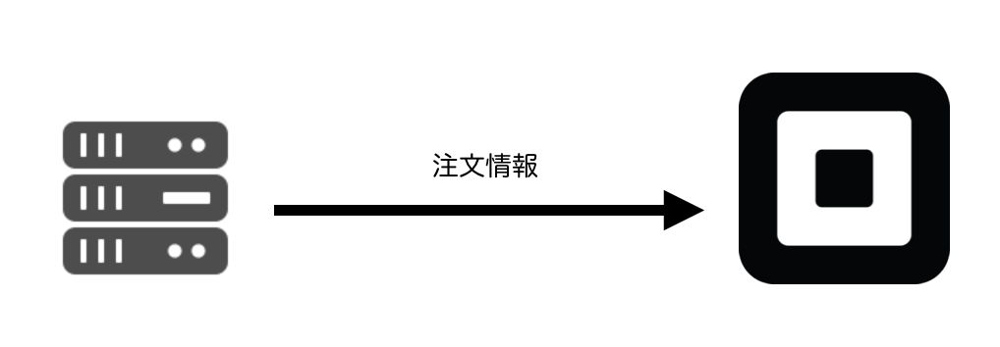

# Square Checkout用URLを取得する

今回はサーバ側の処理になります。注文情報を使ってSquare Checkoutの専用URLを取得します。



最終的にSquare Checkout用のURLを取得し、Webブラウザをリダイレクトさせます。


## 全体像

まずコメントで紹介します。

```
// Square CheckoutのURLを生成してリダイレクトします。
app.post('/checkout', function(req, res) {

  // パラメータの設定
    // 決済後に戻ってくるURL
    // ユニークなID
    // 住所を必要とするかどうか
    // 販売店のサポートメールアドレス
    // 注文情報について
    // 購入者のメールアドレス（オプション）
    // 購入者の配送先情報（オプション）
  
  // 擬似的に5つの商品を生成します
      // 商品名
      // 数量（文字列指定）
      // 商品価格
      // 値引き情報
        // 値引きの名称
        // 値引き価格
      // 税金に関する情報
        // 税金の名前
        // 税金のパーセンテージ
        // 種類

  // Web APIのURL

  // REST APIをコールします
    // POSTメソッドを指定します
    // ヘッダー情報です。アクセストークンを指定します
    // sendの中でパラメータを指定します
      // 処理がうまくいけばこちらに結果がきます
      // Square CheckoutのURLに飛びます
});
```

## パラメータの設定

Square Checkoutに送るパラメータは次のようになります。まず決済後に戻ってくるURLやユニークなIDを指定します。注文する商品情報は後半に指定します。購入者のメールアドレスや配送先住所はすべてオプションになります。

```
// パラメータの設定
const params = {
  // 決済後に戻ってくるURL
  "redirect_url": `${serverUrl}/callback`,
  // ユニークなID
  "idempotency_key": uuidv1(),
  // 住所を必要とするかどうか
  "ask_for_shipping_address": true,
  // 販売店のサポートメールアドレス
  "merchant_support_email": "support@example.com",
  // 注文情報について
  "order": {
    // サーバ側で指定するリファレンスIDです。
    "reference_id": 'CHECKOUT_REFERENCE_ID',
    "line_items": []
  },
  // 購入者のメールアドレス（オプション）
  "pre_populate_buyer_email": req.body.email,
  // 購入者の配送先情報（オプション）
  "pre_populate_shipping_address": {
    "address_line_1": "",
    "address_line_2": "",
    "locality": "",
    "administrative_district_level_1": "",
    "postal_code": req.body.zipCode,
    "country": "JP",
    "first_name": req.body.firstName,
    "last_name": req.body.lastName
  }
};
```

今回は注文商品の情報を擬似的に生成します。数量（quantity）と税金のパーセンテージ（percentage）は文字列として指定する必要があります。値引き（discounts）と税金（taxes）は複数指定可能（配列）になっています。注意してください。

```
// 擬似的に5つの商品を生成します
for (let i = 0; i < 5; i++) {
  let productNo = i + 1;
  params.order.line_items.push({
    // 商品名
    "name": `商品 ${productNo}`,
    // 数量（文字列指定）
    "quantity": String(productNo),
    // 商品価格
    "base_price_money": {
      "amount": productNo * 1000,
      "currency": 'JPY'
    },
    // 値引き情報
    discounts: [{
      // 値引きの名称
      "name": `値引き ${productNo}`,
      // 値引き価格
      "amount_money": {
        "amount": productNo * 10,
        "currency": 'JPY'
      }
    }],
    // 税金に関する情報
    "taxes": [{
      // 税金の名前
      "name": `税金 ${productNo}`,
      // 税金のパーセンテージ
      "percentage": String(productNo * 10),
      // 種類
      "type": "ADDITIVE"
    }]
  });
}
```

## Web APIのURL

Web APIのURLは次のようになります。店舗ID（location_id）が必要です。定義は上の方にあるので書き換えてください。

```
// 定数設定
const accessToken = 'MY_ACCESS_TOKEN';
const location_id = 'MY_LOCATION_ID'; // 書き換えてください
  :（省略）
let url = `https://connect.squareup.com/v2/locations/${location_id}/checkouts`;
```

## REST APIをコールします

必要な情報が揃ったのでREST APIを呼び出します。

```
// REST APIをコールします
unirest
  // POSTメソッドを指定します
  .post(url)
  // ヘッダー情報です。アクセストークンを指定します
  .headers({
    'Accept': 'application/json',
    'Content-Type': 'application/json',
    'Authorization': `Bearer ${accessToken}`,
  })
  // sendの中でパラメータを指定します
  .send(params)
  .end(function (response) {
    // 処理がうまくいけばこちらに結果がきます
    // Square CheckoutのURLに飛びます
    res.redirect(response.body.checkout.checkout_page_url);
  });
```

処理の返り値ですが、次のようなJSONデータになります。とても長いですが、基本的にはSquare Checkoutでコールした内容に checkout_page_url が追加された形になっています。

```
// 参考情報です
{
  "checkout": {
    "ask_for_shipping_address": true, 
    // この checkout_page_url が追加されています
    "checkout_page_url": "https://connect.squareup.com/v2/checkout?c=CBA...gAQ", 
    "created_at": "2017-09-12T10:53:01Z", 
    "id": "CBA...AQ", 
    "merchant_support_email": "support@example.com", 
    "order": {
      "line_items": [{
          "base_price_money": {
            "amount": 1000, 
            "currency": "JPY"
          }, 
          :
      }],
      "location_id": "CBA...gAQ", 
      "reference_id": "CHECKOUT_REFERENCE_ID", 
      "total_discount_money": {
        "amount": 150, 
        "currency": "JPY"
      }, 
      "total_money": {
        "amount": 77295, 
        "currency": "JPY"
      }, 
      "total_tax_money": {
        "amount": 22445, 
        "currency": "JPY"
      }
    }, 
    "pre_populate_buyer_email": "", 
    "pre_populate_shipping_address": {
      :
    }, 
    "redirect_url": "http://localhost:3000/callback"
  }
}
```

## 全体像

JavaScript全体のコードは次のようになります。

```
// Square CheckoutのURLを生成してリダイレクトします。
app.post('/checkout', function(req, res) {
  // パラメータの設定
  const params = {
    // 決済後に戻ってくるURL
    "redirect_url": `${serverUrl}/callback`,
    // ユニークなID
    "idempotency_key": uuidv1(),
    // 住所を必要とするかどうか
    "ask_for_shipping_address": true,
    // 販売店のサポートメールアドレス
    "merchant_support_email": "support@example.com",
    // 注文情報について
    "order": {
      // サーバ側で指定するリファレンスIDです。
      "reference_id": 'CHECKOUT_REFERENCE_ID',
      "line_items": []
    },
    // 購入者のメールアドレス（オプション）
    "pre_populate_buyer_email": req.body.email,
    // 購入者の配送先情報（オプション）
    "pre_populate_shipping_address": {
      "address_line_1": "",
      "address_line_2": "",
      "locality": "",
      "administrative_district_level_1": "",
      "postal_code": req.body.zipCode,
      "country": "JP",
      "first_name": req.body.firstName,
      "last_name": req.body.lastName
    }
  };
  
  // 擬似的に5つの商品を生成します
  for (let i = 0; i < 5; i++) {
    let productNo = i + 1;
    params.order.line_items.push({
      // 商品名
      "name": `商品 ${productNo}`,
      // 数量（文字列指定）
      "quantity": String(productNo),
      // 商品価格
      "base_price_money": {
        "amount": productNo * 1000,
        "currency": 'JPY'
      },
      // 値引き情報
      discounts: [{
        // 値引きの名称
        "name": `値引き ${productNo}`,
        // 値引き価格
        "amount_money": {
          "amount": productNo * 10,
          "currency": 'JPY'
        }
      }],
      "taxes": [{
        // 税金の名前
        "name": `税金 ${productNo}`,
        // 税金のパーセンテージ
        "percentage": String(productNo * 10),
        // 種類
        "type": "ADDITIVE"
      }]
    });
  }
  
  // Web APIのURL
  let url = `https://connect.squareup.com/v2/locations/${location_id}/checkouts`;
  
  // REST APIをコールします
  unirest
    // POSTメソッドを指定します
    .post(url)
    // ヘッダー情報です。アクセストークンを指定します
    .headers({
      'Accept': 'application/json',
      'Content-Type': 'application/json',
      'Authorization': `Bearer ${accessToken}`,
    })
    // sendの中でパラメータを指定します
    .send(params)
    .end(function (response) {
      // 処理がうまくいけばこちらに結果がきます
      // Square CheckoutのURLに飛びます
      res.redirect(response.body.checkout.checkout_page_url);
    });
});
```

----

ここまででSquare CheckoutのURLを取得し、Webブラウザをリダイレクトさせるところまで完成しました。次はSquare Checkoutの処理と、その後の結果表示について紹介します。

[Square Checkoutの結果を表示する](./4-3.md)に進んでください。
